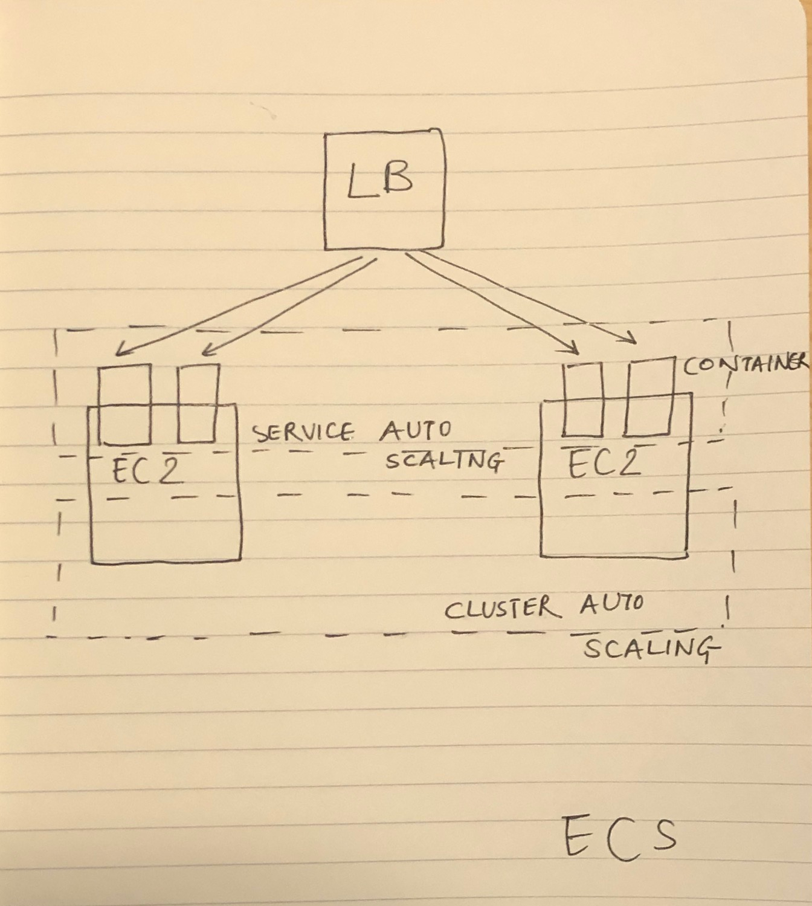

# ML-Assessment

### Introduction

We are working on a machine learning system that predicts male or female based
on three input variables:
- Height
- Weight
- Shoe size

A data scientist, working seperately from you, has created a machine learning model
in the form of a serialized/pickled file called "a_model.joblib"

You don't need to know how this file was produced, but only that you can load the model
from disk and pass it height/weight/shoesize to get a prediciton.  If you are curious, you can look
at the train_model.py to see how the file was created.

An example of how to load the model and call it is in the run_model.py file.

#### Your task - Create 3 things

1) Create an HTTP/Web API for this model.   This would generally be done using Flask
or FastAPI 

2) Package up your REST api in a docker container, using a Dockerfile to build the container

3) Describe (or draw) how you might deploy this API/docker container on AWS.  Assume
this is a high volume and critical part of our systems and must have high availability.
This does NOT need to be fancy.  A photo of a hand-drawn diagram is just fine.

#### Your submission

Send back to proofpoint
1) Your complete python code solution for the REST api - Please review the app.py in app directory
2) Your dockerfile that packages your code as a container - Please review dockerfile
3) Your description (or drawing) of how you would deploy this system.

##### Description:
I would use AWS Elastic Container Registry and Elastic Container Service to deploy the container. I made this choice because it is highly available, easier to deploy, and a secure option when it comes to hosting containers on AWS. The other option that I considered was AWS EKS service but it would depend on how many containers are we hosting in production. I would choose EKS if that number is more than 100 because EKS is easier to manage but difficult to deploy. With containers less than 100, I would prefer AWS ECS service as it is easier to deploy. Also, ECS is cheaper. EKS costs $0.20/hour for each cluster. ECS only costs as much as the resources utilized. ECS offers more integration with AWS services like IAM, Load-Balancers, VPC, AWS Fargate which I think is more convenient for the scenario.

##### How would I deploy?

Create a Dockerfile -----> Push the Dockerfile to ECR--------> Create ECS task

##### Step1: Login to AWS ECR
I would use the terminal to login: 
aws ecr get-login-password --region us-east-1 | docker login --username AWS --password xyz

##### Step 2: Upload the image to ECR
docker tag test:latest <name_of_the_repository>:latest
docker push <name_of_the_repository>:latest

##### Step 3: Create a cluster with ECS
I will use the AWS console for this and select attributes like Name, size, VPC, subnets, Security Group, IAM role.

##### Step 4: Create a task definition:
Select EC2 instance
Task definition name
Add container
select the ARN value
Select the right port mappings
Choosing the placement strategy to spread will make it highly available
We can also put an autoscaling group for the EC2 instance to scale them up when there is more load

##### Step 5: Run the task:
The image gets deployed to the EC2 machine

##### Step 6: Make the Security Group changes:
Open the required port.

##### tep 7: Test 
Try and access the DNS:port address. If it runs the app, then the deployment was successful.

